# FFF — rundvisning

**Fælles Formiddags Fædre har fået sit eget klubhus på nettet.** Denne guide er
en rundtur i alt hvad siden kan, med billeder fra hver enkelt side.

Siden ligger på **[fffloge.dk](https://fffloge.dk)** og er lukket for alle andre
end os — der er ingen offentlige sider, ingen tilmelding og ingen der kan kigge
med. Alt kræver login.

Den er bygget til telefonen først. Alle billederne herunder er taget på en
telefon, præcis som du kommer til at se den. På computer bliver det samme
indhold bare bredere.

> Billederne viser opdigtet demo-indhold — navne, begivenheder og beskeder er
> fundet på til denne rundvisning.

**Skal den printes?** Der ligger en kort udgave på fire A4-sider i
[`FFF-kom-godt-i-gang.pdf`](FFF-kom-godt-i-gang.pdf) — kun det vigtigste, plus
installation, notifikationer og kalender-feed. Kilden er
[`DEMO-print.html`](DEMO-print.html), som kan åbnes i en browser og printes
direkte.

---

## Indhold

1. [Log ind](#1-log-ind)
2. [Forsiden](#2-forsiden)
3. [Kalender](#3-kalender)
4. [Forum](#4-forum)
5. [Chat](#5-chat)
6. [Filer](#6-filer)
7. [Klub 100](#7-klub-100)
8. [Fædre](#8-fædre)
9. [Din profil](#9-din-profil)
10. [Admin](#10-admin)
11. [Læg FFF på din telefon — iPhone og Android](#11-læg-fff-på-din-telefon)
12. [Notifikationer](#12-notifikationer)
13. [Kalenderen i din egen kalender-app](#13-kalenderen-i-din-egen-kalender-app)
14. [På computer](#14-på-computer)
15. [Kort fortalt](#15-kort-fortalt)

---

## 1. Log ind

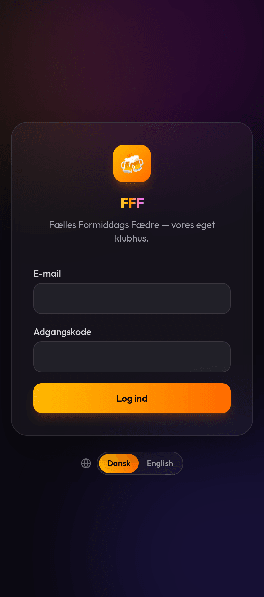

Du får en e-mail og en startadgangskode af Farmand. Log ind én gang, så husker
telefonen dig — du skal ikke logge ind hver gang.

Du kan skifte adgangskode bagefter under **Din profil**, og siden findes både på
dansk og engelsk (skifteren nederst på login-siden og på profilsiden).

---

## 2. Forsiden

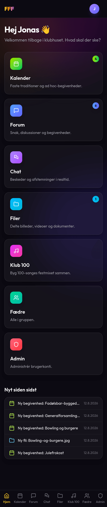

Forsiden er indgangen til det hele:

- **Ét kort pr. område** — Kalender, Forum, Chat, Filer, Klub 100, Fædre.
- **Tallet i hjørnet** er det du ikke har set endnu. På billedet er der 4 nye
  begivenheder, 6 nye forum-indlæg og 1 ny fil siden sidste besøg.
- **“Nyt siden sidst”** nederst samler den seneste aktivitet ét sted, så du kan
  hoppe direkte derhen.

Nederst er den sorte menubjælke, som følger med på alle sider.

---

## 3. Kalender

Kalenderen er stedet hvor både vores faste traditioner og de spontane
arrangementer bor.

### Månedsoverblik

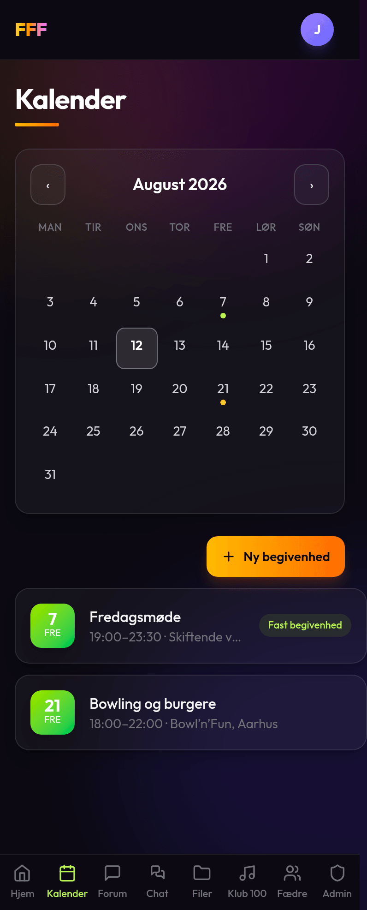

Prikker markerer dagene med noget i kalenderen, og listen under viser månedens
begivenheder med tid og sted. Grøn = fast begivenhed, gul = ad hoc.

### En begivenhed — og tilmelding

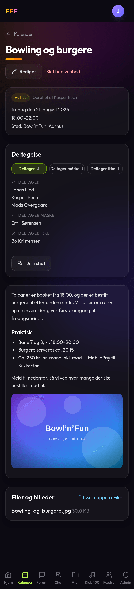

Hver begivenhed har sin egen side med tid, sted, beskrivelse, billeder og
vedhæftede filer — og **tilmelding**:

> **Deltager · Deltager måske · Deltager ikke**

Du trykker på din knap, og alle kan se hvem der kommer. Ikke flere
SMS-tråde hvor ingen ved hvor mange der skal købes ind til.

Knappen **“Del i chat”** sender begivenheden ind i en chatkanal som et kort med
et direkte tilmeldings-link.

### Ture over flere dage

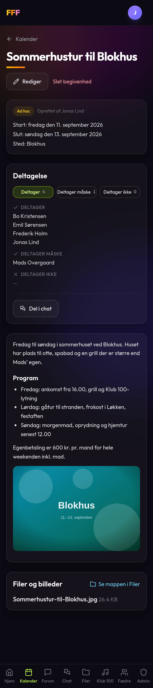

En weekendtur oprettes med start- og slutdato og fylder hele perioden i
kalenderen — her sommerhusturen fra fredag til søndag i september:

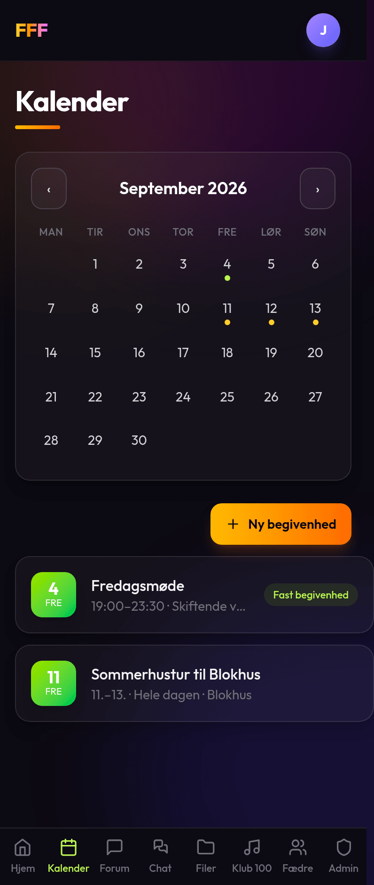

### Faste traditioner

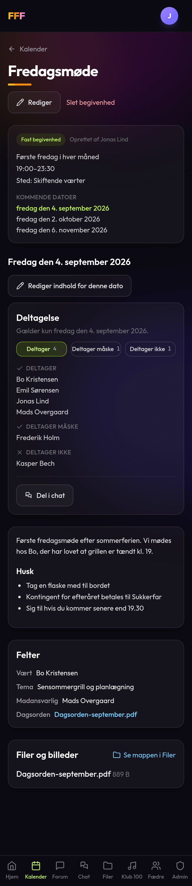

Fredagsmøde den første fredag i måneden, sommerfest hver juni, julefrokost den
12. december — de oprettes **én gang** og gentager sig selv for evigt. Siden
viser reglen og de næste datoer.

Der er tre slags gentagelse:

| Mønster | Eksempel |
| --- | --- |
| Ugedag hver måned | Første fredag i hver måned |
| Ugedag én gang om året | Første lørdag i juni |
| Fast dato hvert år | Den 12. december |

### Hver dato har sit eget indhold

Selvom fredagsmødet er én tilbagevendende begivenhed, har **hver enkelt dato**
sin egen beskrivelse, sine egne filer, sin egen tilmelding og sine egne
**felter**: Vært, Tema, Madansvarlig, Dagsorden.

Felterne defineres én gang for hele serien og udfyldes derefter dato for dato —
så vi altid kan slå op hvem der var vært i november sidste år.

### Opret en begivenhed

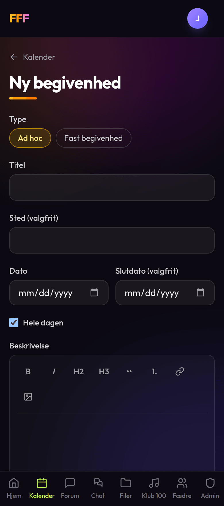 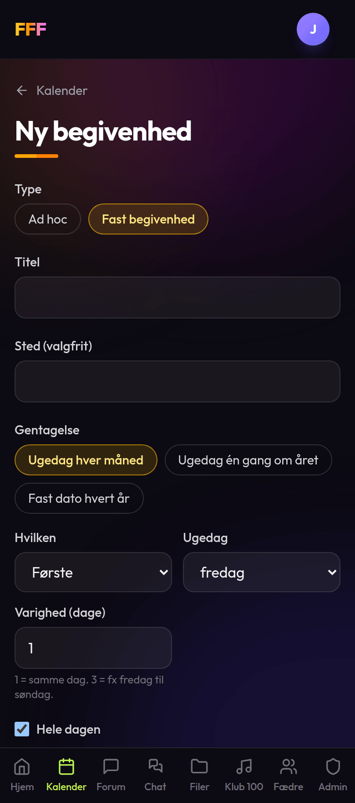

Alle kan oprette ad hoc-begivenheder. Faste, tilbagevendende begivenheder kan
kun oprettes af bestyrelsen — så kalenderens rygrad ikke bliver rodet til.

---

## 4. Forum

Forummet er til det der skal kunne findes igen — i modsætning til chatten, hvor
tingene ruller væk.

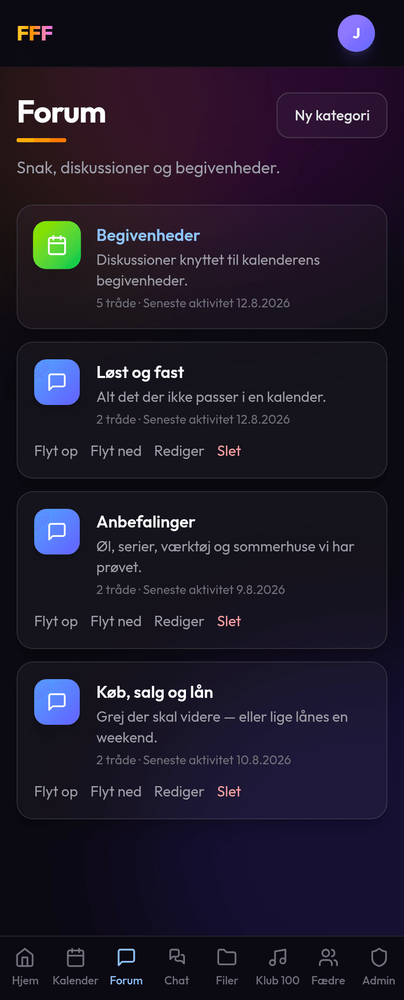

Sektionerne styres af administratoren. **Begivenheder** øverst er speciel: den
laves automatisk og har en tråd til hver eneste begivenhed i kalenderen, så
snakken om bowlingturen ligger sammen med selve bowlingturen.

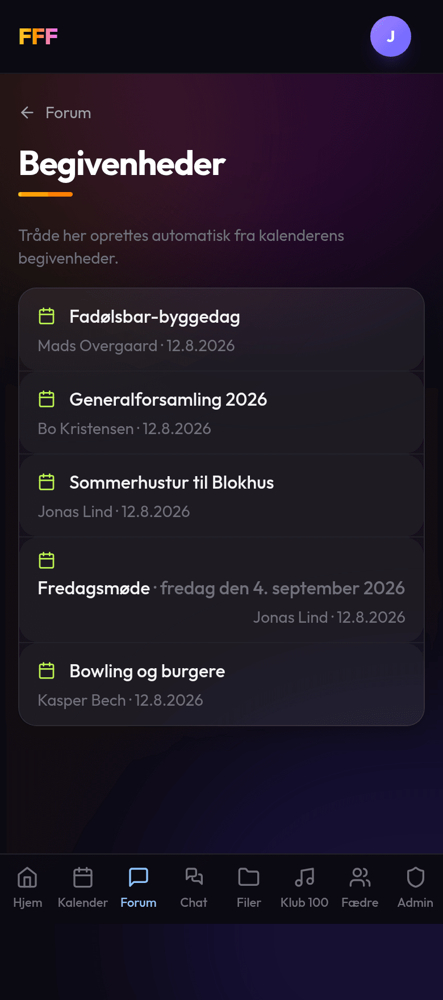 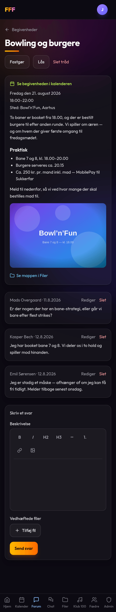

En begivenhedstråd viser selve begivenheden øverst — med tid, sted og tilmelding
— og svarene nedenunder.

Alle andre sektioner er helt almindelige: opret en tråd, og svar på den.

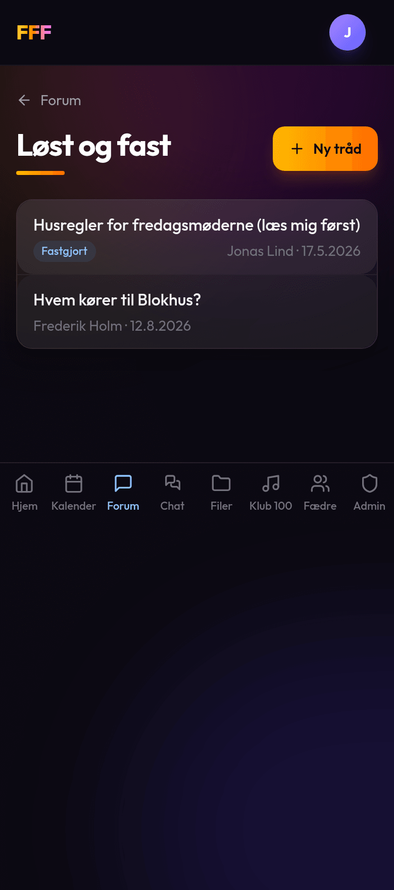 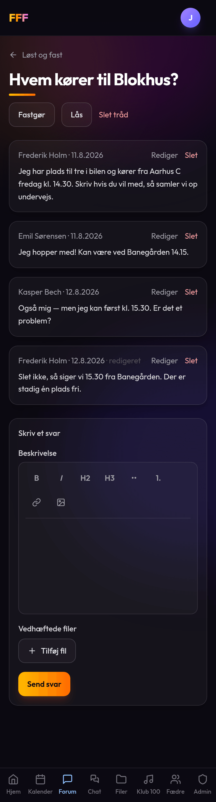

Tråde kan fastgøres øverst (fx husreglerne) eller låses, når snakken er slut.

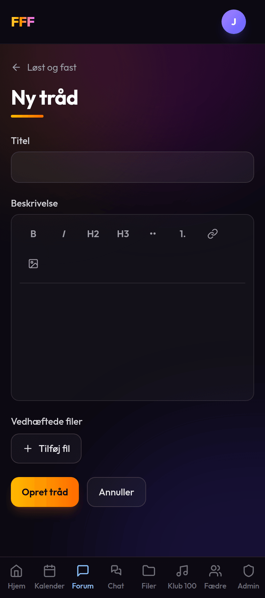

Skriveruden kan overskrifter, fed skrift, punktopstilling, links, billeder og
vedhæftede filer — og alt hvad du hænger på et indlæg, havner automatisk i
filarkivet.

---

## 5. Chat

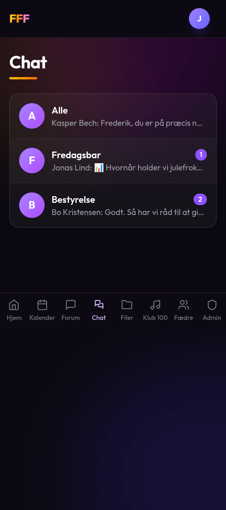 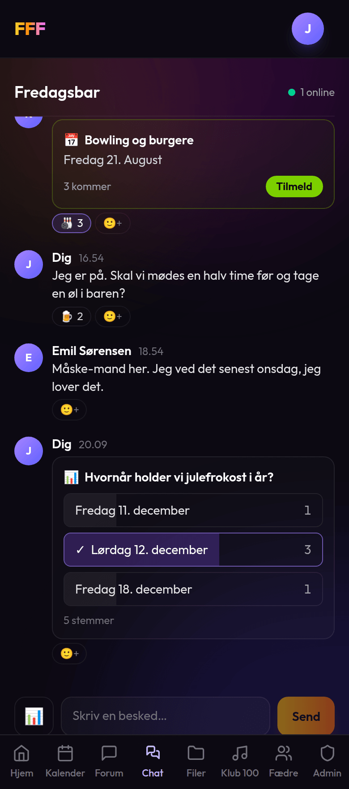

Chatten er den hurtige kanal — beskeder kommer frem med det samme, uden at
siden skal genindlæses.

- **Kanaler** i stedet for én stor gruppe: Alle, Fredagsbar, og en lukket
  kanal for bestyrelsen.
- **Reaktioner** — tryk på smileyen for at give en 👍 eller 🍺 uden at fylde
  tråden med “haha”.
- **Afstemninger** — “Hvornår holder vi julefrokost?” med ét tryk pr. mand og
  live resultat.
- **Begivenhedskort** — del en begivenhed fra kalenderen direkte i kanalen med
  en Tilmeld-knap.
- **Ulæst-tal** på kanallisten, så du kan se hvor der er sket noget.

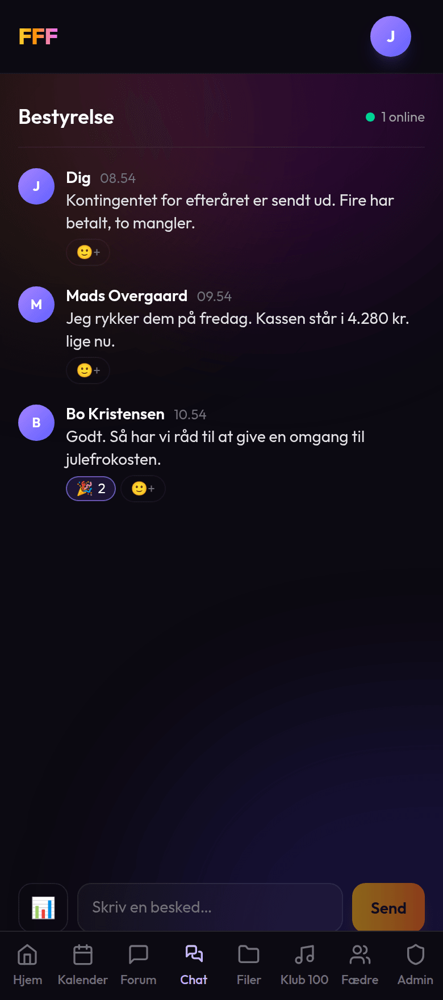

Bestyrelseskanalen kan kun ses af bestyrelsen. Den optræder slet ikke for
andre.

---

## 6. Filer

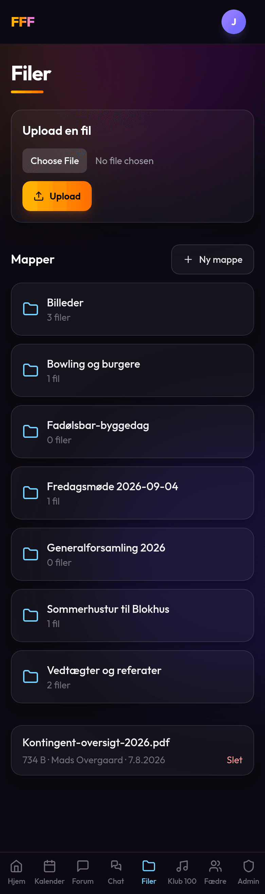 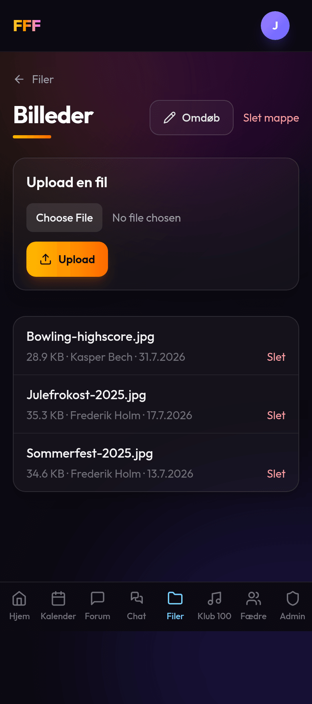

Ét sted til vedtægter, referater, regnskab og billeder. Mapper oprettes efter
behov, og hver begivenhed får automatisk sin egen mappe til dagsordener og
billeder.

Filerne ligger ikke offentligt tilgængeligt: de kan kun hentes af en der er
logget ind.

---

## 7. Klub 100

100 sange, ca. et minut af hver, og en skål imellem. Det plejer at tage en hel
aften at klippe sammen — her bygger vi det sammen, hen over året.

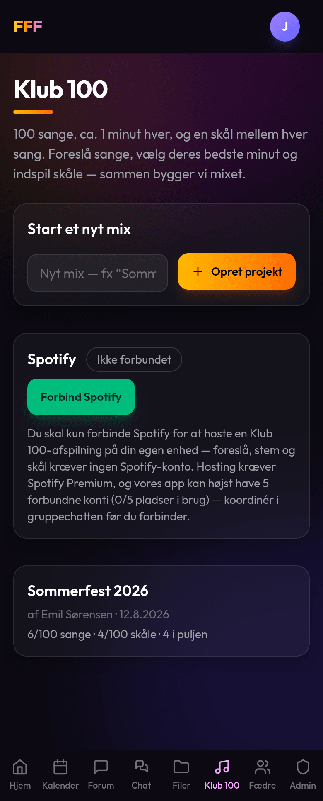

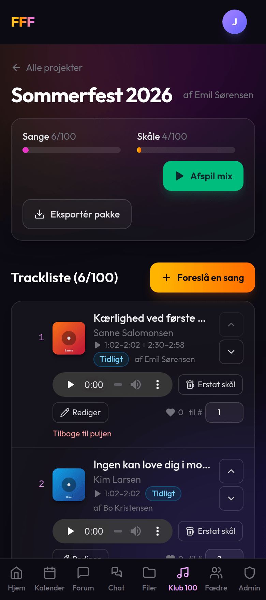 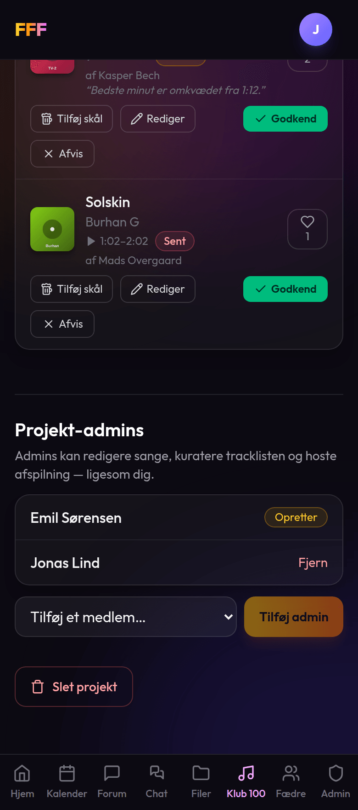

Sådan fungerer det:

1. **Foreslå en sang** — søg den frem, og vælg det ene minut der skal med (eller
   to stykker, hvis sangen fortjener det).
2. **Stem** på de forslag der skal have en plads. Puljen kan filtreres efter om
   sangen hører til tidligt, midt i eller sent på aftenen.
3. **Kuratorerne godkender** de bedste til tracklisten og sætter rækkefølgen.
4. **Indspil skåle** — optag din egen skål direkte i telefonen. Den bliver lagt
   ind mellem sangene. Mangler der en, bruges standardskålen.
5. **Afspil mixet** til festen, eller eksportér hele pakken.

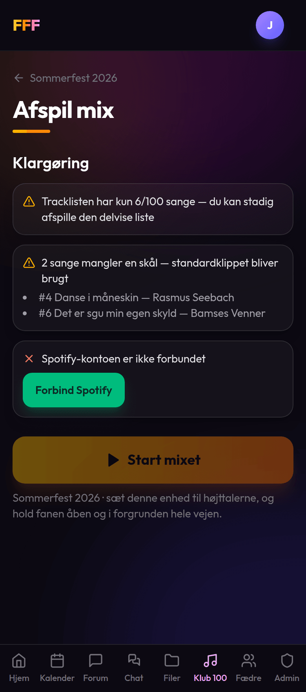

Afspilningsskærmen tjekker det hele igennem først: hvor mange sange der er,
hvilke der mangler en skål, og om Spotify er klar. Kun den der **hoster**
afspilningen skal have Spotify Premium — at foreslå, stemme og skåle kræver
ingenting.

---

## 8. Fædre

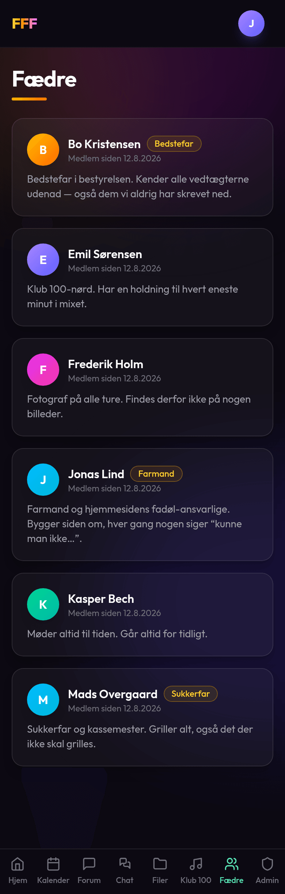

Alle i gruppen, med en kort bio og bestyrelsens titler: **Farmand**,
**Bedstefar** og **Sukkerfar**.

---

## 9. Din profil

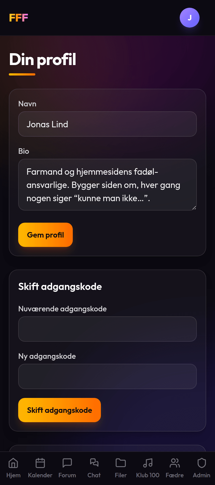 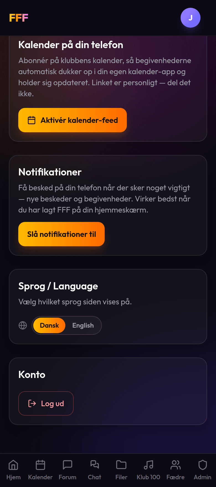

På din egen side kan du:

- rette dit navn og din bio (det er den, de andre ser under **Fædre**),
- skifte adgangskode,
- abonnere på klubbens kalender i din egen kalender-app,
- slå notifikationer til på telefonen,
- skifte sprog mellem dansk og engelsk,
- logge ud.

---

## 10. Admin

Kun for administratorer.

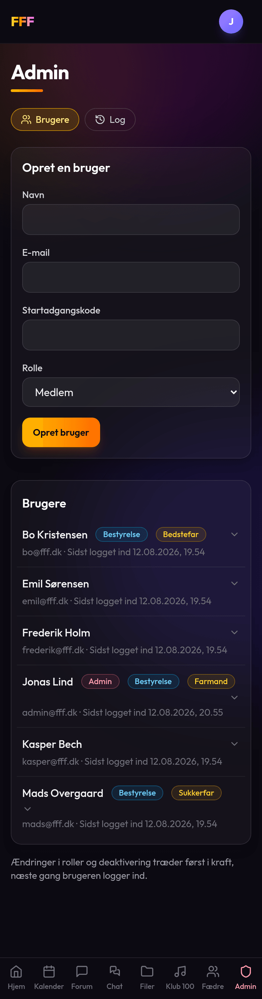 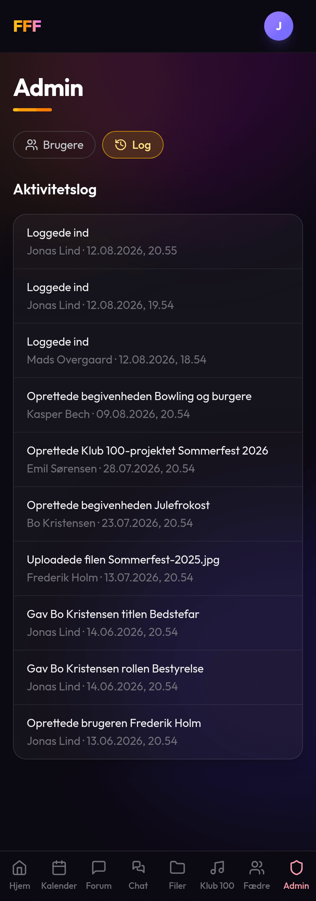

Her oprettes nye medlemmer, nulstilles glemte adgangskoder, tildeles roller og
bestyrelsestitler, og deaktiveres konti. Aktivitetsloggen viser hvem der har
gjort hvad — praktisk den dag nogen spørger hvor referatet blev af.

Menupunktet **Admin** findes slet ikke for almindelige medlemmer:

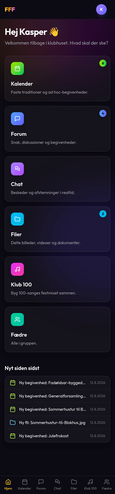

---

## 11. Læg FFF på din telefon

Siden er ikke i App Store eller Google Play — den lægges direkte på
hjemmeskærmen fra browseren. Bagefter opfører den sig som en app: eget ikon,
fuld skærm, ingen browser-adresselinje.

**Det er også en forudsætning for notifikationer på iPhone.**

### iPhone og iPad

1. Åbn **fffloge.dk i Safari** (det virker kun fra Safari — ikke Chrome).
2. Tryk på **Del-knappen** ⬆️ nederst på skærmen.
3. Rul ned og vælg **“Føj til hjemmeskærm”**.
4. Tryk **Tilføj**.
5. Åbn FFF fra hjemmeskærmen — herfra bruger du den som en app.

Prøver du at slå notifikationer til fra en almindelig Safari-fane, siger siden
selv til:

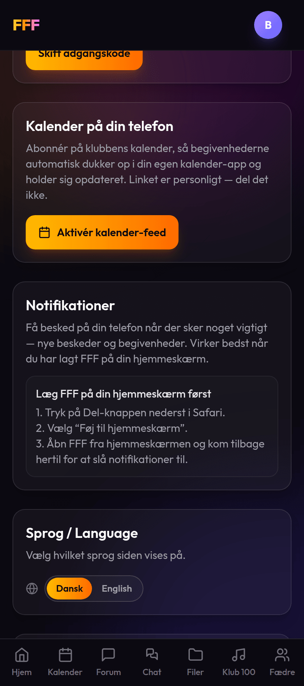

### Android

1. Åbn **fffloge.dk i Chrome**.
2. Tryk på **menuen ⋮** øverst til højre.
3. Vælg **“Installer app”** (eller “Føj til startskærm”).
4. Bekræft — ikonet lægger sig på startskærmen.

På Android virker notifikationer også uden at installere, men appen på
startskærmen er rarere at bruge.

---

## 12. Notifikationer

Når FFF ligger på hjemmeskærmen:

1. Åbn FFF fra hjemmeskærmen.
2. Gå til **Din profil** (tryk på din avatar øverst til højre).
3. Tryk **“Slå notifikationer til”**.
4. Sig **Tillad** til telefonens spørgsmål.
5. Tryk **“Send en testnotifikation”** for at se at det virker.

**Hvad får du besked om?** Chatten: nye beskeder, nye afstemninger og
begivenheder der bliver delt i en kanal. Er du allerede inde i appen, får du det
live i stedet — så du ikke får en notifikation om noget du står og kigger på.

**Godt at vide**

- Det slås til **pr. enhed**. Har du både telefon og iPad, skal du gøre det
  begge steder.
- Du kan altid slå det fra igen samme sted.
- Sagde du ved et uheld “Bloker”, skal det slås til igen i telefonens
  indstillinger for Safari/Chrome — siden fortæller dig det.

---

## 13. Kalenderen i din egen kalender-app

Du behøver ikke åbne FFF for at se hvornår der sker noget. Klubbens kalender kan
abonneres på, så begivenhederne dukker op i din egen kalender og holder sig
opdateret af sig selv.

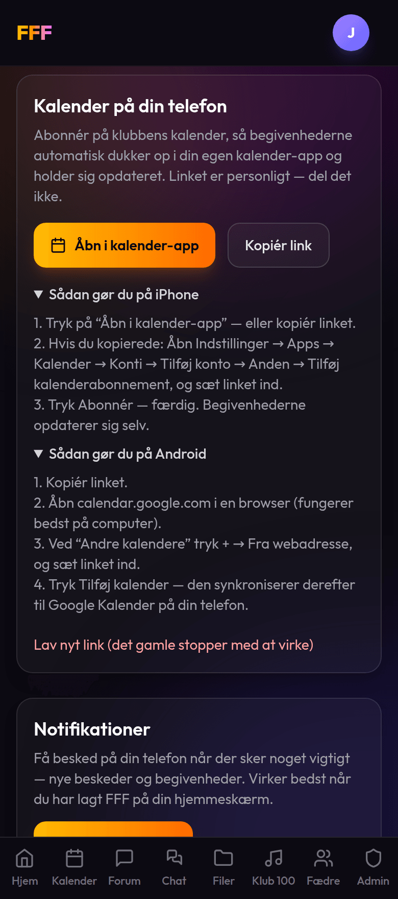

**Din profil → Kalender på din telefon → Aktivér kalender-feed.** Derefter:

- **iPhone:** tryk “Åbn i kalender-app” og bekræft abonnementet.
- **Android:** kopiér linket, åbn calendar.google.com (nemmest på computer), og
  tilføj det under *Andre kalendere → Fra webadresse*.

Vejledningen står også på selve siden. Linket er personligt — del det ikke.

---

## 14. På computer

Samme side, bredere layout. Menuen flytter op i toppen.

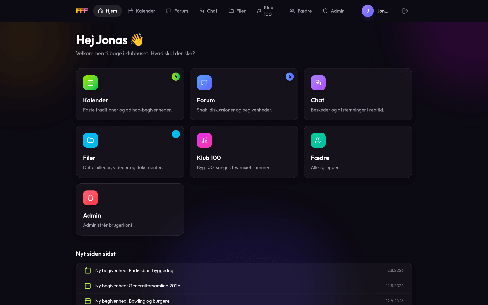

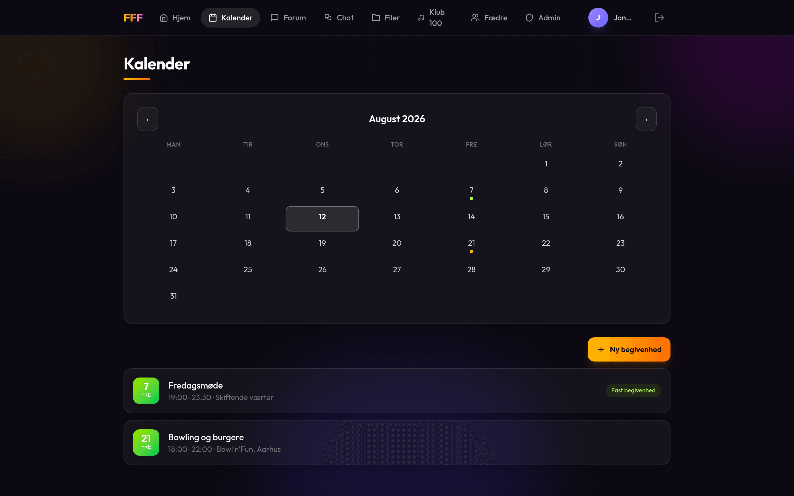

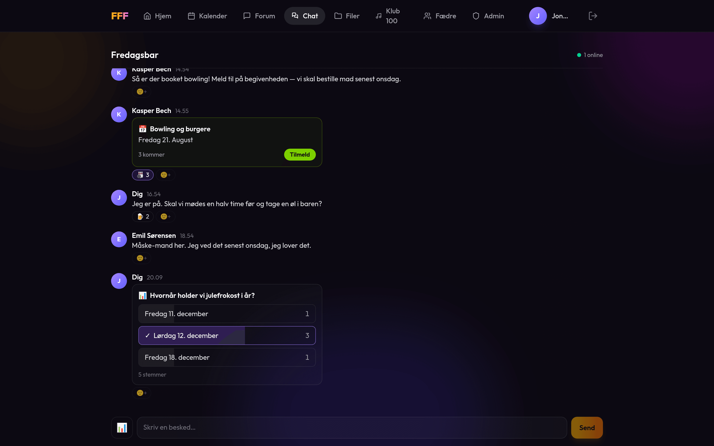

Og for dem der hellere vil have engelsk:

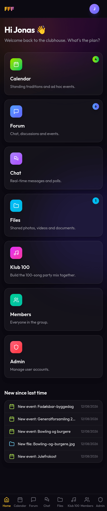

---

## 15. Kort fortalt

| Vil du… | Så gå til |
| --- | --- |
| se hvornår der sker noget | **Kalender** |
| melde til eller fra | **Kalender** → begivenheden → Deltager / Måske / Ikke |
| sige noget hurtigt | **Chat** |
| sige noget der skal kunne findes igen | **Forum** |
| finde referatet eller billederne | **Filer** |
| foreslå en sang til festen | **Klub 100** |
| skifte adgangskode eller sprog | **Din profil** |
| få besked på telefonen | **Din profil** → Notifikationer |

**Sådan kommer du i gang:**

1. Log ind på [fffloge.dk](https://fffloge.dk) med den kode du har fået.
2. Skift adgangskode under Din profil.
3. Læg FFF på hjemmeskærmen (afsnit 11).
4. Slå notifikationer til (afsnit 12).
5. Meld til bowling. 🎳
